# Требования к проекту
---

# Содержание
1 [Введение](#intro)  
1.1 [Назначение](#appointment)  
2 [Требования пользователя](#user_requirements)  
2.1 [Программные интерфейсы](#software_interfaces)  
2.2 [Интерфейс пользователя](#user_interface)  
2.3 [Характеристики пользователей](#user_specifications)  
2.3.1 [Классы пользователей](#user_classes)  
2.3.2 [Целевая аудитория](#target_audience)                                   
3 [Системные требования](#system_requirements)  
3.1 [Функциональные требования](#functional_requirements)  
3.2 [Нефункциональные требования](#non-functional_requirements)  

<a name="intro"/>

# 1 Введение

<a name="appointment"/>

## 1.1 Назначение

В этом документе описаны функциональные и нефункциональные требования к приложению «CVTOOL» для web. Проект представляет собой корпоративный инструмент для сбора и хранения информации о своих сотрудниках, а также для создания резюме в формате pdf/docx с индивидуальным корпоративным дизайном. 

<a name="user_requirements"/>

# 2 Требования пользователя

<a name="software_interfaces"/>

## 2.1 Программные интерфейсы
Проект включает в себя как клиентскую часть, так серверную часть. Клиент должен быть реализован с использованием современных фронтенд технологий, а именно ReactJS. Сервер должен быть реализован с использованием современных бэкенд технологий, а именно такого фреймворка как Ruby on Rails. Сервер должен осуществлять активное взаимодействие с базой данных PostgresQL для хранения всей информации приложения, включая информацию о пользователях, резюме, проектах, скиллов, департаментов и вопросов. Также сервер должен иметь хорошую документацию для упрощения работы фронтенд разработчика. Документация должна быть сделана с помощью Swagger.

<a name="user_interface"/>

## 2.2 Интерфейс пользователя

Далее представлен интерфейс, разработанный совместно с дизайнером. При входе в приложение, пользователь должен попасть на экран авторизации.

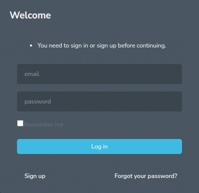

После авторизации обычный пользователь должен попасть на страницу заполнения резюме, которая состоит из 5 шагов. На первом шаге пользователь должен ввести персональнаю информацию: личные данные, образование, позицию, способности.
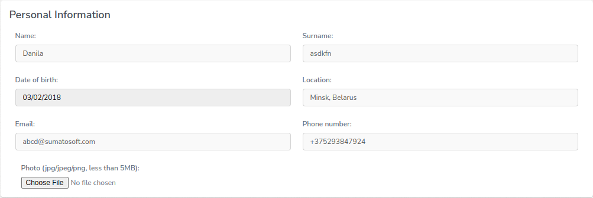
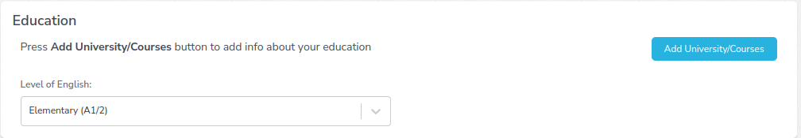
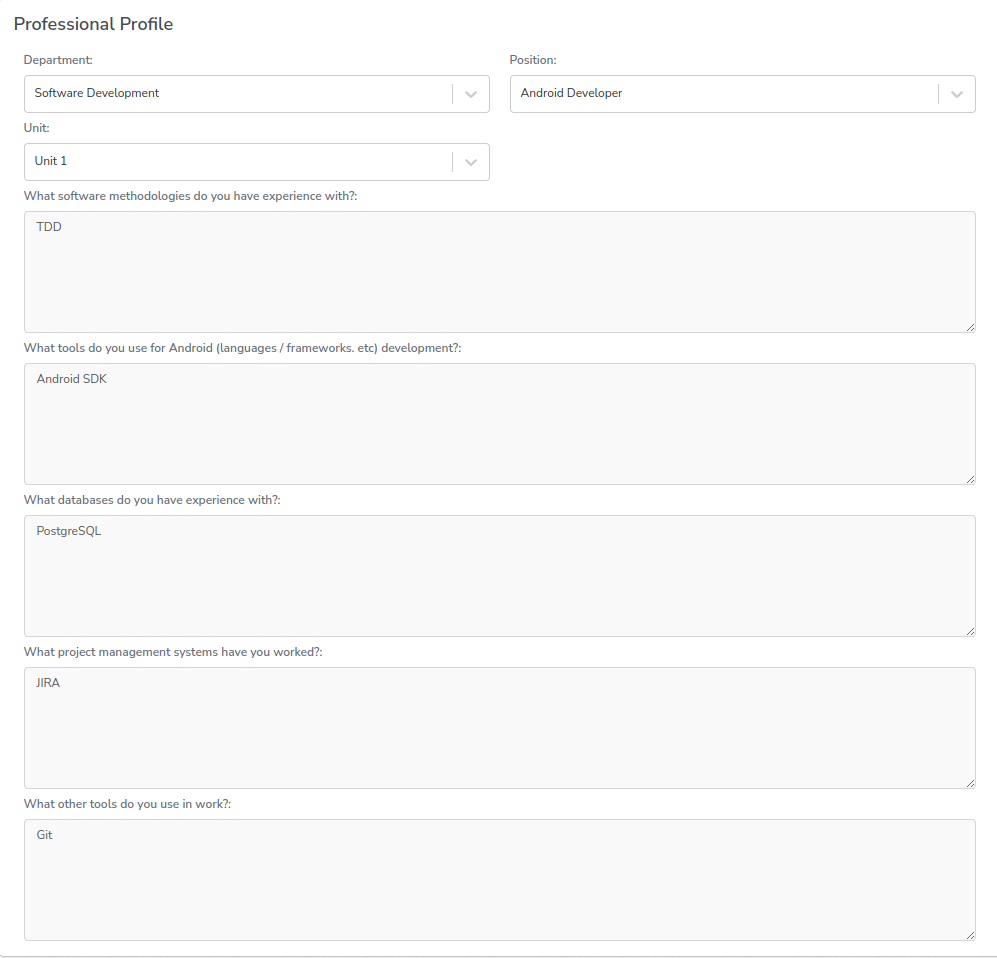
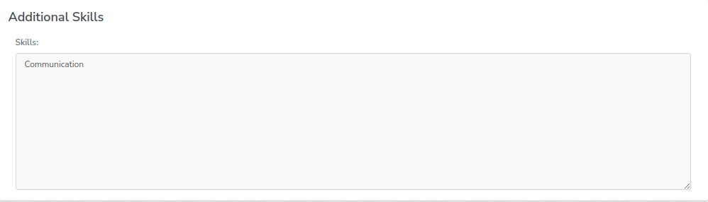

На втором шаге пользователь должен ввести опыт работы в предыдущих компаниях.
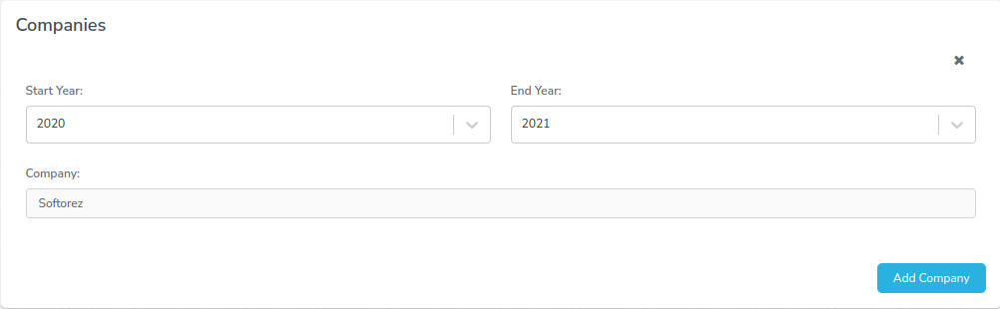
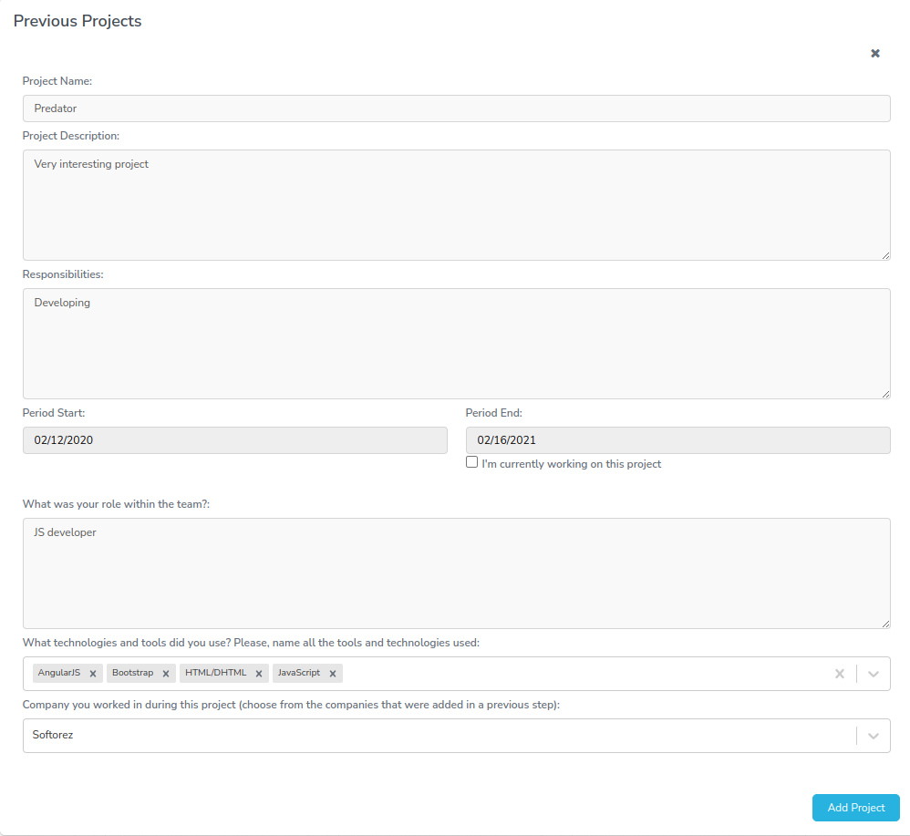

На третьем шаге пользователь должен ввести опыт работы в текущей компании.
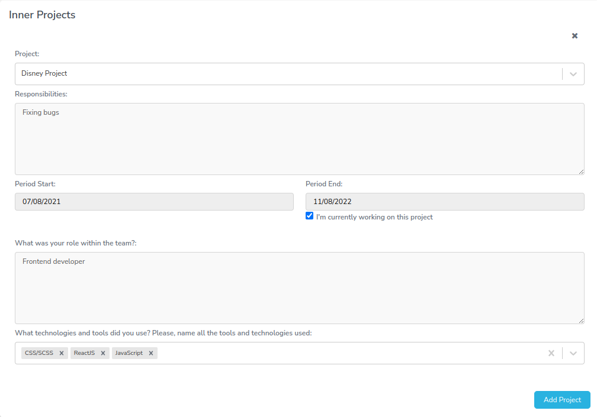

На четвертом шаге должна появиться матрица скиллов, которая будет сгенерирована исходя из данных, введенных на втором и третьем шаге, и которую можно редактировать.
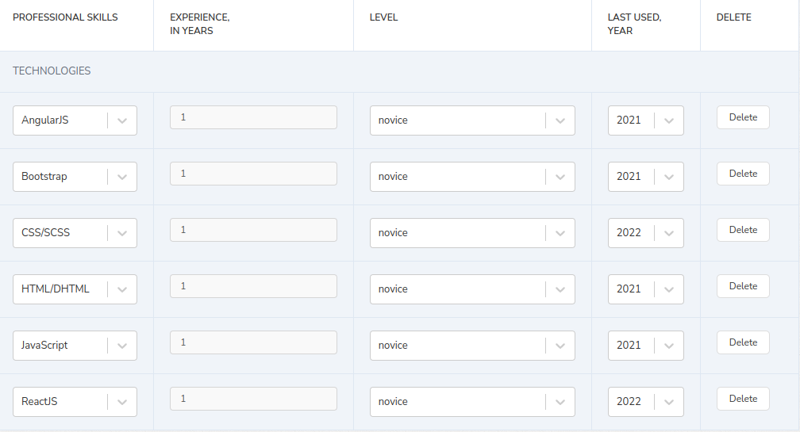

На пятом шаге будет располагаться превью из заполненных на предыдущих шагах данных. После заполнения резюме пользователь будет видеть две кнопки: отправить на ревью координатору и редактировать резюме.                                                                                      

 
Пользователь, зашедший под аккаунтом координатора, при логине будет видеть список пользователей с фильтрами.
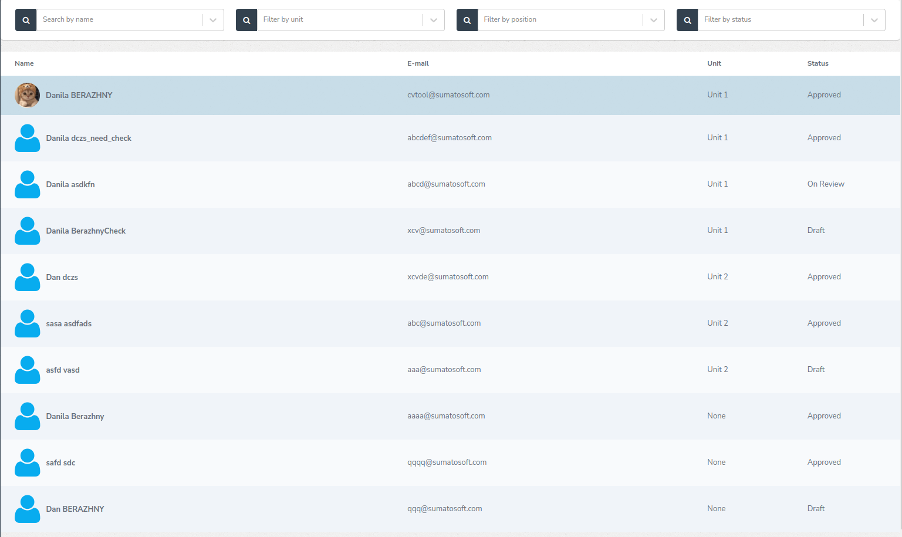

Зайдя в просмотр резюме со статусом "On Review", координатор должен иметь возможность утвердить резюме или же отправить на доработку. Так же он должен мочь отредактировать данное резюме и скачать его в формате pdf/docx(При нажатии на кнопку "CV" должно появиться модальное окно).
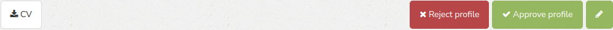
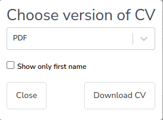

Пользователь, зашедший под аккаунтом супер-админа, кроме всех возможностей координатрота, должен мочь отредактировать всю внутреннюю информацию о компании, а именно проекты, департаменты, юниты, позиции, вопросы, скиллы.
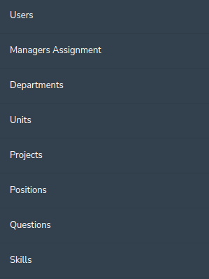

<a name="user_specifications"/>

### 2.3 Характеристики пользователей

<a name="user_classes"/>

#### 2.3.1 Классификация пользователей

В приложении существуют 3 группы полезователей:

1. Обычные пользователи
2. Координаторы
3. Супер-админ

Обычные пользователи - пользователи, которые зарегистрировались и авторизировались в приложении. Они могут заполнять свое резюме и отправлять его на проверку координаторам.
Координаторы - пользователи, которым супер-админ дал права особые права. Они могут просматривать, редактировать, одобрять или возвращать обратно резюме обычных пользователей.
Супер-админ - пользователь, который наделен особыми правами через серверскую консоль. Они имеют все права координаторов, а также могут назначать их.

<a name="target_audience"/>

#### 2.3.2 Целевая аудитория

Данное приложение ориентированно на it-компании и их сотрудников.

<a name="system_requirements"/>

## 3. Системные требования

<a name="functional_requirements"/>

### 3.1 Функциональные требования

Должны быть реализованы следующие возможности:
1. Регистрация пользователей
2. Авторизация пользователей
3. Заполнение резюме
4. Предпросмотр резюме
5. Редактирование резюме других пользователей координаторами и супер-админом
6. Список заполненных резюме
7. Поиск резюме с помощью фильтрации
8. Генерация резюме в формате pdf или docx

<a name="non-functional_requirements"/>

### 3.2 Нефункциональные требования

1. Версия Rails 6.1.5.
2. Версия React 16.4.2.
3. Версия Sidekiq 5.1.3.
4. Версия PostgreSQl 9.0.
5. Поддерживаемые браузеры: Google Chrome версии 96.0 и выше, Mozilla Firefox версии 98.0 и выше, Opera версии 70.0 и выше, Microsoft Edge версии 100 и выше.
